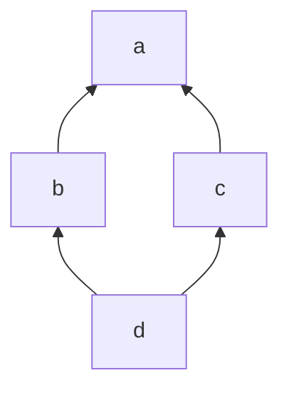
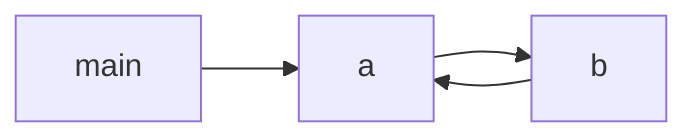

# Modules et packages

Depuis le début du semestre, nous avons souvent utilisé plusieurs fichier `.py` dans le même projet.
Au minimum, nous avions un fichier `.py` pour le code principal, et un pour les tests associés.
Nous ne sommes cependant pas attardé sur le sens réel d'avoir plusieurs fichiers, et ses conséquences.

Dans ce court chapitre, nous étudions plus en détail les notions de *modules* et de *packages*.

**Ce chapitre ne fait pas partie de la "matière d'examen".**
Vous devez savoir importer depuis des bibliothèques, mais on ne vous demandera pas de définir des modules ni des packages en examen.

## Sommaire

{::options toc_levels="2..3" /}

* This will become a table of contents (this text will be scrapped).
{:toc}

## Modules

Indépendemment de Python, un *module* est une "portion" réutilisable d'un programme informatique.
On *compose* les modules entre eux *via* leurs imports et exports.

Un module peut *exporter* certains services qu'il définit : des classes, des fonctions, des constantes globales, etc.
Ces services seront alors disponibles pour d'autres modules.
Les services exportés consistuent *l'interface* du module.
Un module peut aussi définir des fonctions, classes et constantes annexes qui ne sont pas exportées, et sont donc des détails d'implémentation (encapsulés dans le module).

Un module peut *importer* des services depuis d'autres modules.
Il peut alors s'en servir pour fournir à son tour des services qu'il exportera.

Remarquez les similitudes entre cette notion de module et la notion de classe : tous deux ont une interface, publique, et ont des détails d'implémentation encapsulés.
Ils fonctionnent à des échelles différentes : les modules sont plus "larges" que les classes.
Plus important, les modules sont *uniques*.
Là où les classes peuvent avoir de zéro à plusieurs instances, les modules ont toujours exactement une "instance".

Les modules permettent de rassembler des fonctionnalités en groupes logiques.

Les modules prennent des formes différentes en fonction des langages, mais respectent toujours les propriétés principales ci-dessus.
Nous allons ici détailler la façon dont Python met en œuvre ce concept.

### Modules en Python

En Python, un module = un fichier `.py`.
On peut importer d'autres modules avec un `import`.
Par défaut, en Python, *toutes* les définitions d'un module sont exportées :

```python
# a.py

ONE = 1

# inc est implicitement exportée
def inc(x: int) -> int:
    return x + ONE
```

On importe un module avec `import a`, puis on peut accéder à ses définitions exportées avec `a.inc`.
On voit ici aussi la similitude avec les classes : `a` apparaît comme une instance d'une classe, avec un attribut `inc`.

```python
# b.py

import a

def main() -> None:
    print(a.ONE) # 1
    print(a.inc(5)) # 6
```

> Par convention, en Python, les noms des modules sont toujours constitués uniquement de lettres minuscules sans accent (ASCII).

Lorsqu'on charge le module `b`, on commence par exécuter l'instruction

```python
import a
```

Cette instruction se comporte plus ou moins comme un appel de fonction : on va chercher le module `a` et on le charge à son tour, avant de continuer le chargement du module `b`.
Lorsque toutes les instructions trouvées dans `a.py` ont été exécutées, Python peut créer l'unique instance du module `a` et le stocker une fois pour toutes.
Les définitions exécutées dans le module deviennent des *attributs* du module créé.
Le chargement du module `b` reprend alors, dans lequel `a` est une référence à cette unique instance.

Lorsqu'on accède à `a.ONE` ou `a.inc`, on fait référence aux attributs du module `a`, qui sont bien les définitions qui se trouvaient dans `a.py`.

### `from ... import ...`

Si on utilise souvent tout ou partie des membres d'un module qu'on importe, on peut utiliser la syntaxe `from ... import ...`.

```python
# b.py

from a import ONE, inc

def main() -> None:
    print(ONE) # 1
    print(inc(5)) # 6
```

La syntaxe `from a import *` importe *tous* les membres définis par `a.py`.

### Dépendances transitives et unicité

Puisque des modules peuvent en importer d'autres, on peut créer des dépendances en chaîne, ou dépendances *transitives*.
Voici un exemple pour illustrer cela :

```python
# a.py

def add(x: int, y: int) -> int:
    return x + y
```

```python
# b.py

import a

def inc(x: int) -> int:
    return a.add(x, 1)
```

```python
# c.py

import a

def sub(x: int, y: int) -> int:
    return a.add(x, -y)
```

```python
# d.py

import b
import c

def main() -> None
    print(b.inc(c.sub(15, 3))) # 13
```

On a alors les dépendances suivantes.



Lorsqu'on charge `d`, cela déclenche le chargement de `b`, qui a son tour charge `a`.
Lorsque `a` est initialisé, son instance est construite.
On finit alors le chargement de `b`, puis on passe au chargement de `c`.

`c` veut alors charger `a` également.
Rappelez-vous que les modules ont une instance *unique*.
Python a retenu que `a` a déjà été chargé, et donc le `import a` dans `c.py` renvoie la *même, unique* instance du module `a`.
On n'initialise donc jamais deux fois un module.
Tous les modules qui importent `a` se partagent l'unique instance de ce module.

### Dépendances circulaires

Que se passe-t-il si deux modules veulent utiliser les services l'un de l'autre ?
Ils voudront alors s'importer mutuellement, ce qui crée une dépendance circulaire.
Rien qu'à cause des types, cela arrive plus facilement qu'on ne le croit.
D'ailleurs, un certain nombre d'entre vous en ont déjà fait les frais en voulant décomposer leur projet.

```python
# a.py

from b import bar

class C:
    x: int
    ...
    def foo(self) -> int:
        return bar(self)
```

```python
# b.py

from a import C

def bar(c: C) -> int:
    return c.x + 1
```

```python
# main.py

from a import C

def main() -> None:
    x = C(52)
    print(x.foo())
```

Avec cette structure, on obtient un graphe de dépendances *cyclique* :



Lorsqu'on lance `main.py`, on doit importer `a`, qui doit importer `b` ... qui doit importer `a`.
À ce moment Python essaye d'être indulgent, et nous donne le module `a` "en cours de construction".
Cependant, le `from a import C` a directement besoin de `a.C` pour initialiser la variable locale `C`.
Puisque `a` est encore en construction, `a.C` n'existe pas, et nous recevons l'erreur suivante :

```
Traceback (most recent call last):
  File "main.py", line 6, in <module>
    import a
  File "a.py", line 5, in <module>
    from b import bar
  File "b.py", line 5, in <module>
    from a import C
ImportError: cannot import name 'C' from 'a' (consider ...)
```

Il est possible d'éviter le problème en retardant le moment où `b` aura besoin de `a.C`.
Au lieu de `from a import C`, on peut utiliser seulement `import a`, puis faire référence à `a.C` explicitement quand on en a besoin.
On applique la même stratégie pour `b.bar`.

```python
# a.py

import b

class C:
    x: int
    ...
    def foo(self) -> int:
        return b.bar(self)
```

```python
# b.py

import a

def bar(c: a.C) -> int:
    return c.x + 1
```

Python peut alors exécuter les définitions de `b.py` alors que `a` n'est pas encore tout à fait construit.
Cela permet ensuite à `a.py` de se terminer également.
Les références a `b.bar` et `a.C` ne doivent être *résolues* qu'une fois qu'on *appelle* réellement les classes et méthodes en question.

Notez que la référence à `a.C` dans la *signature* de `def bar` n'est pas requise pour définir `bar`.
Elle ne sera requise que lors du premier appel.

## Packages

Les packages ("paquets" en français, mais on utilise plutôt le mot anglais) sont des groupes de modules.
Alors qu'un module est représenté par un *fichier*, un package est représenté par un *dossier*.
Pour que Python reconnaisse un dossier comme étant un package, il doit contenir un fichier nommé exactement `__init__.py`.

Vous avez déjà utilisé des packages depuis le début du semestre : nous avons systématiquement placé nos *tests* dans un dossier `tests/`.
On vous a par ailleurs dit de créer un fichier vide `__init__.py` dans ce dossier.
Vos dossiers de tests sont donc tous des packages.

Si un projet prend suffisamment d'ampleur, il peut être judicieux de regrouper les modules par packages.
Les packages peuvent contenir d'autres packages, et forment ainsi une structure hiérarchique.

Je recopie ici l'exemple donné [dans la documentation de Python](https://docs.python.org/3/tutorial/modules.html#packages), qui propose une structure pour un projet hypothétique de traitement audio :

```
sound/                   Top-level package
 ├─ __init__.py          Initialize the sound package
 ├─ formats/             Subpackage for file format conversions
 │   ├─ __init__.py
 │   ├─ wavread.py
 │   ├─ wavwrite.py
 │   ├─ aiffread.py
 │   ├─ aiffwrite.py
 │   ├─ auread.py
 │   ├─ auwrite.py
 │   └─ ...
 ├─ effects/             Subpackage for sound effects
 │   ├─ __init__.py
 │   ├─ echo.py
 │   ├─ surround.py
 │   ├─ reverse.py
 │   └─ ...
 └─ filters/             Subpackage for filters
     ├─ __init__.py
     ├─ equalizer.py
     ├─ vocoder.py
     ├─ karaoke.py
     └─ ...
```

Les modules à l'intérieur des packages reçoivent des noms hiérarchiques, séparés par des `.`, comme `sound.formats.wavread`.
Si on veut importer une fonction `read_wav_file` depuis `sound.formats.wavread`, on écrira donc

```python
from sound.formats.wavread import read_wav_file
```

Si on préfère importer `wavread` comme nom court, et écrire ensuite `wavread.read_wav_file` (par exemple pour résoudre des dépendances circulaires), on écrira :

```python
from sound.formats import wavread
```

Cette notation doit être utilisée *peu import d'où on fait l'import*.
Même si on est dans le module `sound.formats.wavwrite`, il faut quand même écrire le nom complet de `sound.formats.wavread`.

Par exemple, si vous voulez déplacez tous les modules de votre projet dans un package `platformer`, vous devrez :

1. Créer un dossier `platformer/` dans votre projet.
2. Créer un fichier vide `__init__.py` dans ce dossier.
3. Déplacer tous vos `.py` dans ce dossier.
4. *Changer tous vos imports* pour faire référence aux noms complets, comme `from platformer.gameview import GameView`.

Il existe [une syntaxe dédiée pour importer depuis le même package](https://docs.python.org/3/tutorial/modules.html#intra-package-references), mais mon impression est qu'elle n'est pas très utilisée.
